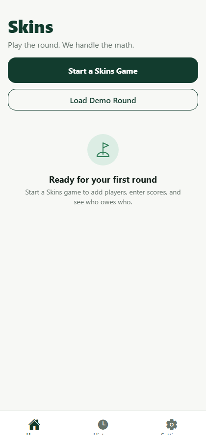
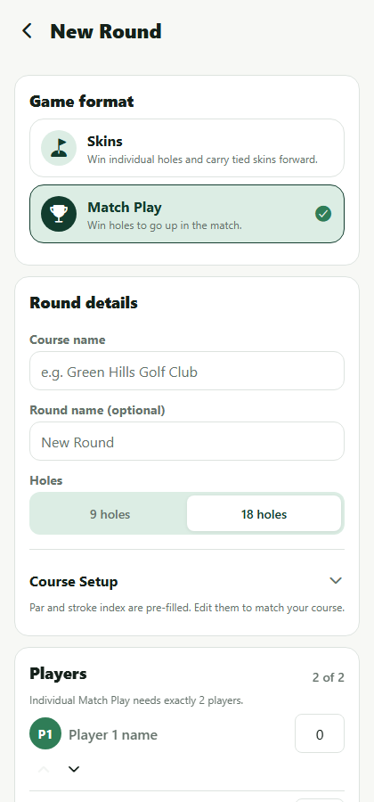
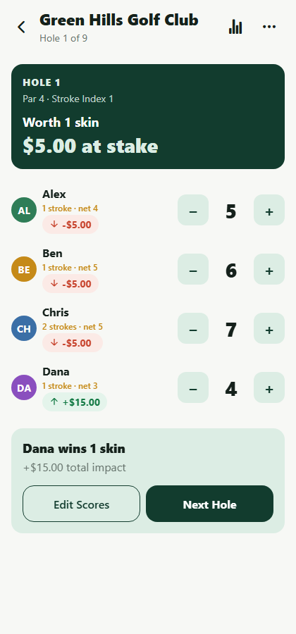
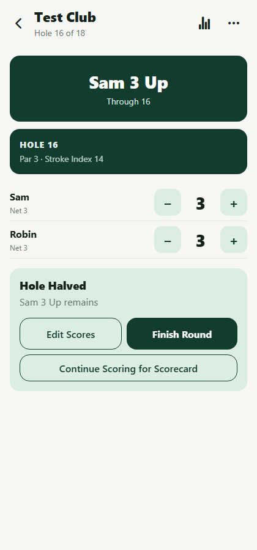
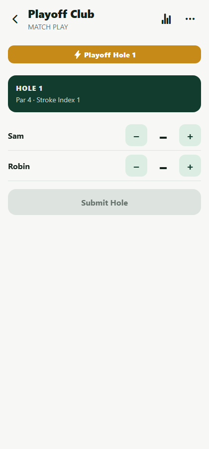
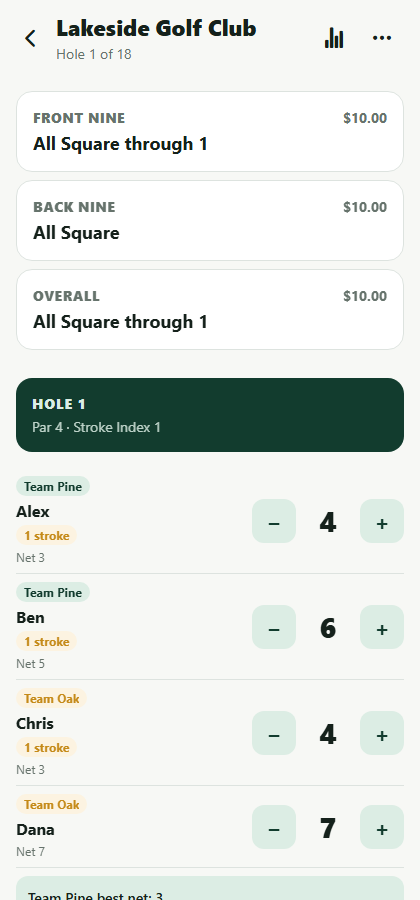
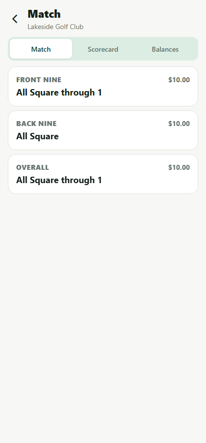
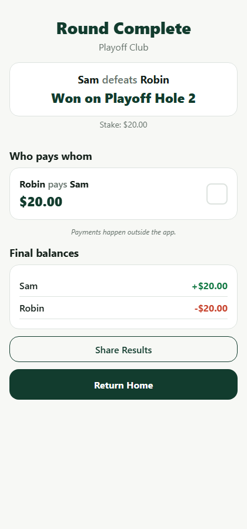
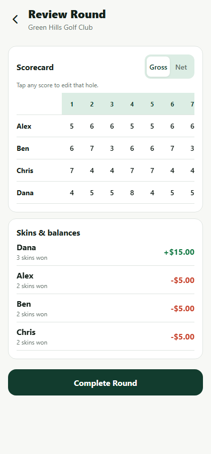
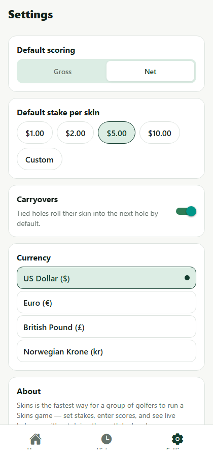

# Skins

**Play the round. We handle the math.**

Skins is a mobile-first Expo / React Native app that lets a group of golfers set up a **Skins** or **Match Play** game, enter scores hole by hole, watch live balances/match status, and get an optimized "who pays whom" settlement at the end of the round. Everything runs locally on-device — there's no backend, no account, and no payment processing. The app only calculates results; players settle up however they normally would.

## Tech stack

- [Expo](https://expo.dev) (SDK 57) + React Native 0.86 + React 19
- [Expo Router](https://docs.expo.dev/router/introduction/) for file-based navigation
- [Zustand](https://github.com/pmndrs/zustand) + `AsyncStorage` for local state and persistence
- [Zod](https://zod.dev) for runtime validation (forms + persisted-data integrity)
- TypeScript throughout, strict mode
- Jest for unit tests

## Getting started

```bash
npm install
npm start          # opens the Expo dev tools; scan the QR code with Expo Go
# or target a platform directly:
npm run ios
npm run android
npm run web
```

Requires Node 18+ and, for iOS/Android, either the [Expo Go](https://expo.dev/go) app on a physical device or a configured simulator/emulator.

### Running the tests

```bash
npm test          # single run
npm run test:watch
```

**118 unit tests** cover the core game logic:
- Skins: handicap allocation, scoring (ties, single/multiple carryovers, a final-hole tie), player balances, settlement optimization.
- Match Play: adjusted/relative handicaps, individual and team hole scoring, match status (All Square → Up → Dormie → Complete), result formatting (`3 & 2` / `1 Up` / `Match Halved` / `Won on Playoff Hole N`), sudden-death playoffs, Nassau (Front/Back/Overall independence, early completion, 9-hole rejection), Match Play balances and Nassau balances.
- Persistence: schema migration from the pre-Match-Play (v1) data shape, Match Play round round-tripping (including in-progress playoff state), and safe rejection of corrupted state.

See [Testing](#testing) below for the full file-by-file breakdown.

### Trying it out quickly

In development builds (`__DEV__`), the Home screen shows three seed-data buttons so you can jump straight into score entry without filling out the Create Round form:

- **Load Skins Demo** — 9-hole Net Skins at Green Hills Golf Club, 4 players, $5/skin, carryovers on.
- **Load Individual Match Demo** — 18-hole Net Match Play, Alex vs. Ben, 100% handicap allowance, $20 stake, sudden-death playoff tie rule.
- **Load Team Nassau Demo** — 18-hole Net Team Match Play at Lakeside Golf Club, Team Pine (Alex, Ben) vs. Team Oak (Chris, Dana), 90% allowance, Nassau structure, $10/match.

## Project structure

```text
app/                          expo-router routes (screens only — no business logic)
  _layout.tsx                  root stack: tabs group + the round flow
  (tabs)/                      bottom tab navigator: Home, History, Settings
    index.tsx                   Home
    history/                    History list (with format filter) + read-only round detail
    settings.tsx                 grouped Skins / Match Play / General defaults
  create-round.tsx              format selection + format-specific setup form (modal)
  round/[roundId]/              the active-round flow, outside the tab bar
    index.tsx                    hole-by-hole scoring — branches by format, plus the playoff flow
    leaderboard.tsx               Skins: Balances/Skins views. Match Play: Match/Scorecard/Balances views
    review.tsx                    final scorecard + edit-any-hole + match/Nassau/playoff summary
    settlement.tsx                 winner or match-result card, settlement, share, final balances

src/
  components/                  generic, reusable UI primitives (buttons, cards, badges, ...)
  features/
    rounds/                     round creation, selectors, recalculation, demo data, Match Play
                                 setup sub-forms (mode/scoring/handicap/structure/stake/tie rule,
                                 team assignment)
    settlements/                 share-text formatting
    history/                     round summary card shared by Home + History (format-aware)
  store/                       Zustand store, validated AsyncStorage persistence, schema migration
  types/                       core data models (Skins + Match Play)
  utils/                       pure, unit-tested game-logic functions
    matchPlay/                  Match Play-specific logic (handicap, hole scoring, status,
                                 result formatting, playoff, Nassau, balances, round orchestrator)
  validation/                  Zod schemas for forms and persisted data (both formats)
  constants/                   design tokens (colors/spacing/type) and golf constants
  test-utils/                  shared test fixtures (round/player/hole/score factories)
```

`app/` intentionally stays thin — every screen reads from `useAppStore` and composes components; all scoring, balance, and settlement math lives in `src/utils` and is exercised independently of any UI.

### Route structure note

The product spec's suggested route tree lists `history/`, `settings.tsx`, and `index.tsx` as siblings of `create-round.tsx`. Implementing an actual bottom tab bar with Expo Router requires grouping the tabbed screens under an `(tabs)` route group (a URL-transparent folder) — so those three routes live at `app/(tabs)/...` instead. The round-flow screens (`create-round`, `round/[roundId]/*`) stay outside that group, matching the spec's intent that they should not appear inside the tab bar.

## Data model

`Round` is a single type shared by both formats, with format-specific configuration and results kept in their own optional sub-objects rather than flattened onto the round:

```ts
type Round = {
  // shared
  id, name, courseName, createdAt, completedAt, holeCount, currentHole, status,
  format: "skins" | "match_play", currency, players, holes, scores,

  // present when format === "skins"
  skinsConfig?: SkinsConfig,
  skinsResult?: SkinsRoundResult,   // derived cache, see below

  // present when format === "match_play"
  matchPlayConfig?: MatchPlayConfig,
  matchPlayResult?: MatchPlayRoundResult,   // derived cache
  matchPlayPlayoffScores?: PlayerHoleScore[],  // playoff scores, kept separate from regulation `scores`
};
```

`skinsResult` / `matchPlayResult` are never hand-edited — they're always the output of `calculateSkinResults(round)` / `calculateMatchPlayRoundResult(round)`, re-run by the store (`recalculateRoundResult`) every time `scores` or the round's config changes. This is the same "derive, don't mutate" pattern the original Skins-only build used, just generalized across both formats.

## Match Play logic

Match Play unifies Individual (2 players) and Team (4 players, 2v2) modes by normalizing both into two generic **sides** (`getMatchPlaySides`) — an individual side just wraps one player. Every hole/status/result function is written once against "side A vs. side B" and works for both modes; team scoring only special-cases at the lowest level (`calculateTeamMatchPlayHole`, which reduces each side's raw member scores to a best-ball score before the same head-to-head comparison individual mode uses).

| File (`src/utils/matchPlay/`) | Responsibility |
| --- | --- |
| `handicap.ts` | `calculateAdjustedHandicap` (applies the allowance %), `calculateRelativeMatchPlayHandicaps` (low-player method — works for 2 or 4 players), `getMatchPlayStrokesForHole` |
| `holeResult.ts` | `calculateIndividualMatchPlayHole`, `calculateTeamMatchPlayHole`, `calculateMatchStatus` (pure status reducer), `isDormie`, `isMatchComplete` |
| `scoring.ts` | `calculateMatchPlayHoleResults` — walks a match's holes in order, freezing the official result the instant it's decided while still recording later "scorecard-only" holes |
| `result.ts` | `calculateMatchPlayResult`, `formatMatchPlayResult` (`"3 & 2"` / `"1 Up"` / `"Match Halved"` / `"Won on Playoff Hole N"`) |
| `playoff.ts` | `calculatePlayoffHoleResults` — sudden death, reusing course holes from Hole 1 |
| `nassau.ts` | `calculateNassauMatches` — Front Nine / Back Nine / Overall as three independent matches |
| `balances.ts` | `calculateMatchPlayBalances`, `calculateNassauBalances` |
| `round.ts` | `calculateMatchPlayRoundResult` — the per-round orchestrator, analogous to `calculateSkinResults` |

**Early completion vs. "Continue Scoring for Scorecard":** once a match is mathematically decided (`isMatchComplete`), the deciding hole's result is frozen as the official outcome. If the user chooses to keep entering scores anyway, those later holes are still recorded (and shown on the scorecard) but never change `winnerSideId`/`completionHole`/`resultLabel` — see `calculateMatchPlayResult`'s doc comment.

**Sudden-death playoffs are a deliberate, user-triggered screen transition, not a derived one.** Early builds of this feature computed "are we in the playoff?" reactively from `round.matchPlayResult`, which caused the UI to swap to the playoff screen the instant the last regulation hole's second score was entered — before the user ever saw the "Hole 18 Halved" result panel. The active-round screen now only enters playoff mode when the user taps an explicit **Start Playoff** button (and the reverse: advancing from one playoff hole to the next also requires tapping through the tied-hole result, using the same locally-buffered "displayed hole" pattern the regulation flow already used). This was caught by hands-on testing, not the unit suite — pure-function tests can't see React state-machine timing bugs.

**Nassau segments are 100% independent.** `calculateNassauMatches` calls the same hole-walking function three times over three different hole subsets (1-9, 10-18, 1-18), each with its own fresh `status = 0` start and its own early-completion check — the Back Nine never inherits the Front Nine's lead. One subtlety this uncovered: a Nassau segment's *decisive hole* is recorded using the round's real (absolute) hole number (e.g. hole 14 for the 5th hole of the back nine), while the segment's `holeCount` is its own length (9) — naively computing `holeCount - completionHole` for the result label produced nonsense like `"5 & -5"`. The fix was to read `holesRemaining` directly off the deciding `MatchPlayHoleResult` (already segment-relative) instead of re-deriving it; see the regression test in `nassau.test.ts` and the doc comment on `formatMatchPlayResult`'s input type.

**Betting model:** a decided match transfers the configured stake between sides, split evenly across each side's member count — which collapses to "winner takes it all" for Individual (1 member/side) and an even split for Team (2 members/side). A halved match transfers nothing. Nassau sums three independent transfers (front/back/overall) into one net balance per player; undecided or halved segments contribute zero. All of this feeds the same `calculateSettlements` greedy-matching engine Skins already used — the format only differs in how `PlayerBalance[]` gets computed upstream.

## Skins logic (unchanged from the original build)

| File | Responsibility |
| --- | --- |
| `handicap.ts` | `calculatePlayingHandicap`, `getHandicapStrokesForHole`, `calculateNetScore` |
| `skins.ts` | `calculateHoleWinner`, `calculateSkinResults` (ties, carryovers, stops at the first incomplete hole) |
| `balances.ts` | `calculatePlayerBalances` — the "loser pays winner per skin" accounting model |
| `settlements.ts` | `calculateSettlements` — greedy largest-debtor/largest-creditor matching (shared with Match Play) |
| `currency.ts` | `formatCurrency` / `formatSignedCurrency` via `Intl.NumberFormat`, cents-safe conversions |
| `course.ts` | `generateDefaultHoles` — default 9/18-hole par + stroke-index scorecards |

All money is stored and computed as **integer cents** and only converted to a display string at the last possible moment, so no calculation in either format ever touches floating point.

### Handicap model (MVP simplification, applies to both formats)

There's no course/slope rating in this MVP. `playingHandicap = Math.round(player.handicap)`, and for 9-hole rounds that's additionally halved and rounded (`Math.round(fullHandicap / 2)`) before strokes are allocated. Strokes are then given out using the standard stroke-index method. Match Play layers a **handicap allowance percentage** (100/90/85/75%) and the **low-player method** on top: every player's adjusted handicap is reduced by the lowest adjusted handicap among the players in that match, so the strongest player always plays off zero — see `calculateRelativeMatchPlayHandicaps`.

## Persisted schema & migration

Persisted state carries a `schemaVersion`. Adding Match Play bumped it from an implicit v1 (flat Skins fields directly on `Round`, flat `defaultScoringMode`/etc. on settings) to v2 (the `format`-discriminated shape above, `skinsDefaults`/`matchPlayDefaults`/`currency` grouped settings). `src/store/migrations.ts` runs on every hydration:

- A round with no `format` field is treated as a legacy Skins round: `format: "skins"` is added, and `scoringMode`/`stakePerSkinCents`/`carryoversEnabled`/`skinResults` are moved into `skinsConfig`/`skinsResult`.
- Settings missing the grouped shape get `skinsDefaults` populated from the old flat fields, plus sensible `matchPlayDefaults`.
- Migration runs *before* Zod validation, so a v1 round only fails to load if it's also otherwise malformed — see `migrations.test.ts`, which round-trips a hand-built legacy payload and asserts the migrated shape passes the current schema.
- This was also verified against the real running app (not just Jest): seeding `localStorage` with a legacy-shaped payload and reloading correctly shows the round in Home/History with its balances intact, and rewrites storage in the current shape.

Invalid or corrupted persisted JSON — before or after migration — is discarded rather than thrown; the app boots with a one-time, non-blocking banner instead of crashing or silently losing data.

## Testing

```text
src/utils/__tests__/                       Skins + shared utilities
  handicap.test.ts, skins.test.ts, balances.test.ts, settlements.test.ts,
  currency.test.ts, course.test.ts

src/utils/matchPlay/__tests__/             Match Play
  handicap.test.ts        adjusted handicap, relative (low-player) handicaps for 2 and 4
                           players, allowance percentage, stroke allocation
  holeResult.test.ts       individual/team hole comparators, the status reducer, isDormie,
                           isMatchComplete
  individual.test.ts       gross/net hole wins, halved holes, 3 & 2, 1 Up on 18, a halved
                           regulation match, Dormie, sudden-death playoff (single and
                           multiple tied holes), reusing course holes in the playoff
  team.test.ts             best-ball scoring, different members winning different holes,
                           halved team holes, relative team handicaps, team-assignment
                           validation (duplicate/missing players, wrong team size)
  nassau.test.ts            Front Nine / Back Nine independence, Overall spanning all 18,
                           a 3-0 sweep, a split-with-halved-overall result, early completion
                           for both Front Nine and Overall, the absolute-vs-relative
                           hole-numbering regression, 9-hole rejection
  result.test.ts           formatMatchPlayResult's four output shapes, result freezing
                           after the decisive hole, playoff resolution
  balances.test.ts         individual full-stake transfer, halved-match zero transfer,
                           team even split, Nassau combining three outcomes, zero-sum

src/store/__tests__/
  migrations.test.ts       legacy Skins round/settings migration, schema validation
                           post-migration, Match Play round + active playoff round-tripping,
                           corrupted-state rejection, no-op on already-current state
```

Run `npm test` — all **118 tests** should pass.

## Reusable components

Shared across both formats: `AppHeader`, `PrimaryButton`, `SecondaryButton`, `Card`, `PlayerAvatar`, `PlayerScoreRow`, `ScoreStepper`, `MoneyAmount`, `BalanceBadge`, `HoleProgress`, `LeaderboardRow`, `SettlementCard`, `EmptyState`, `ConfirmationModal`, `SegmentedControl`.

Match Play-specific: `GameFormatCard` (Skins vs. Match Play picker), `MatchStatusCard` (All Square / N Up / Dormie / Complete), `MatchProgressStrip` (hole-by-hole A/B/halved strip with accessible text labels, not symbols alone), `TeamAssignmentCard` + `TeamBadge`, `HandicapStrokeBadge`, `NassauStatusCard`, `MatchResultCard`, `PlayoffBanner`. Skins-specific: `SkinValueCard`.

A few feature-specific compositions (a stake-preset picker shared by both formats, a player-form row with reordering, an expandable course-setup table, a Match Play settings section, a team-assignment section, a round summary card) live next to the feature that owns them under `src/features/` rather than in the generic component library, since they're not reusable outside that context.

Balances and win/loss states never rely on color alone — `MoneyAmount`/`BalanceBadge` pair color with an explicit `+`/`−` sign and an up/down arrow icon, and interactive controls expose accessibility labels and hints throughout.

## Screen walkthrough

| | |
|---|---|
|  **Home** — start a game, resume an in-progress round, or load a dev demo. |  **Create Round** — pick Skins or Match Play before the format-specific settings appear. |
|  **Skins scoring** — the active hole, live strokes/net preview, result panel after submitting. |  **Match Play scoring** — live status card, and once decided: Finish Round / Continue Scoring for Scorecard. |
|  **Sudden-death playoff** — reuses course holes from Hole 1, one hole at a time. |  **Team scoring** — players grouped by team, handicap strokes shown, best-net preview before submitting. |
|  **Leaderboard (Match Play)** — Front Nine / Back Nine / Overall tracked independently. |  **Settlement** — match result, who-pays-whom, final balances, share results. |
|  **Review** — full scorecard (tap any score to edit that hole). |  **Settings** — Skins Defaults / Match Play Defaults / General, grouped. |

These screenshots were captured from real runs of the app (Expo web target), driven end-to-end through round creation → scoring → review → settlement for both formats, including a full 3 & 2 finish, a 1-Up-on-18 finish, a regulation-tied match going to a sudden-death playoff, an 18-hole Nassau with three different sub-match results, and a legacy Skins save file loading through the schema migration — not mockups.

## Known MVP limitations

**Carried over from the original Skins build:**
- **No real course/slope handicap model** for either format — a simplification called out explicitly in the product spec.
- **Default scorecards are generic**, not pulled from a real course database — par and stroke index are editable but start from a fixed template.
- **One active round at a time** — starting a new round while one is in progress requires explicitly discarding it.
- **Settlement checkboxes ("mark as paid") are session-only UI state**, not persisted.
- **Reordering players/teams** uses up/down and swap controls rather than drag-and-drop.
- **The settlement algorithm is greedy**, not a minimum-transaction solver — deterministic and near-minimal, matching the spec's requirement, but not provably optimal in every edge case.

**Match Play-specific:**
- **Nassau always halves a tied segment**, regardless of the configured tie rule — sudden-death playoffs are only supported for a Single Match. The tie-rule picker is a no-op for Nassau; this is a deliberate scope cut rather than a bug (running three simultaneous playoffs was judged out of scope for the MVP).
- **Editing a past playoff hole isn't supported** from the Review screen — "edit any hole" covers regulation holes (which reopens the score-entry screen at that hole, deep-linked via `?hole=N`); playoff holes are entered and reviewed in sequence only. This is a smaller version of a limitation the original spec already accepted for regulation-hole editing complexity.
- **Team assignment during round creation is a simple swap-based UI** (moving a player to the other team swaps them with that team's first member, keeping both teams at exactly 2) rather than free-form drag-and-drop.
- **No four-ball, foursomes, alternate shot, presses, or concessions** — out of scope per the product spec; Team Match Play uses a simplified best-ball rule only.
- **No automated iOS/Android simulator screenshots** were captured in this environment (no simulator available); all verification was end-to-end on the Expo web target, which shares 100% of the app code and business logic with the native builds.
