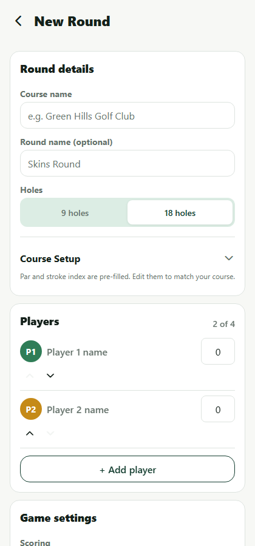
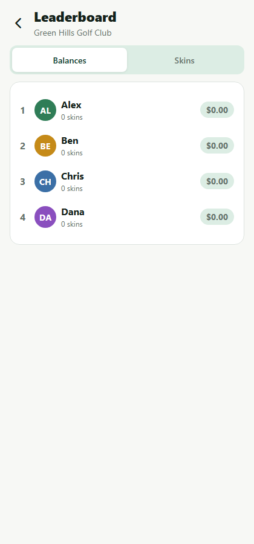
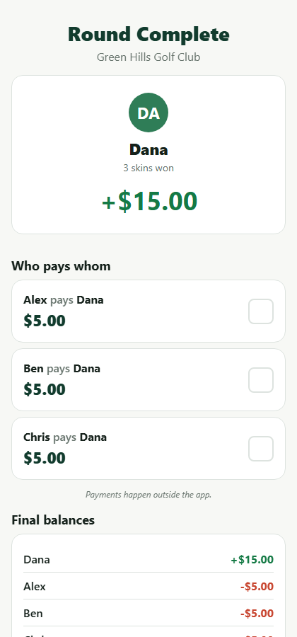

# Skins

**Play the round. We handle the math.**

Skins is a mobile-first Expo / React Native app that lets a group of golfers set up a Skins game, enter scores hole by hole, watch live balances and carryovers, and get an optimized "who pays whom" settlement at the end of the round. Everything runs locally on-device — there's no backend, no account, and no payment processing. The app only calculates results; players settle up however they normally would.

## Tech stack

- [Expo](https://expo.dev) (SDK 57) + React Native 0.86 + React 19
- [Expo Router](https://docs.expo.dev/router/introduction/) for file-based navigation
- [Zustand](https://github.com/pmndrs/zustand) + `AsyncStorage` for local state and persistence
- [Zod](https://zod.dev) for runtime validation (forms + persisted-data integrity)
- TypeScript throughout, strict mode
- Jest for unit tests

## Getting started

```bash
npm install
npm start          # opens the Expo dev tools; scan the QR code with Expo Go
# or target a platform directly:
npm run ios
npm run android
npm run web
```

Requires Node 18+ and, for iOS/Android, either the [Expo Go](https://expo.dev/go) app on a physical device or a configured simulator/emulator.

### Running the tests

```bash
npm test          # single run
npm run test:watch
```

41 unit tests cover the core game logic — handicap allocation, Skins scoring (including ties, single/multiple carryovers, and a final-hole tie), player balances, and settlement optimization. See [Testing](#testing) below for the full breakdown.

### Trying it out quickly

In development builds (`__DEV__`), the Home screen shows a **Load Demo Round** button that seeds a 9-hole Net Skins round at "Green Hills Golf Club" with 4 players and realistic handicaps, matching the round described in the product spec. Use it to jump straight into score entry without filling out the Create Round form.

## Project structure

```text
app/                          expo-router routes (screens only — no business logic)
  _layout.tsx                  root stack: tabs group + the round flow
  (tabs)/                      bottom tab navigator: Home, History, Settings
    index.tsx                   Home
    history/                    History list + read-only round detail (its own stack)
    settings.tsx
  create-round.tsx              multi-section round setup form (modal)
  round/[roundId]/              the active-round flow, outside the tab bar
    index.tsx                    hole-by-hole score entry (Round Overview)
    leaderboard.tsx               live Balances / Skins views
    review.tsx                    final scorecard + edit-any-hole + Complete Round
    settlement.tsx                 winner card, settlement, share, final balances

src/
  components/                  generic, reusable UI primitives (buttons, cards, badges, ...)
  features/
    rounds/                     round creation, selectors, recalculation, demo data
    settlements/                 share-text formatting
    history/                     round summary card shared by Home + History
  store/                       Zustand store + validated AsyncStorage persistence
  types/                       core data models
  utils/                       pure, unit-tested game-logic functions
  validation/                  Zod schemas for forms and persisted data
  constants/                   design tokens (colors/spacing/type) and golf constants
  test-utils/                  shared test fixtures (round/player/hole factories)
```

`app/` intentionally stays thin — every screen reads from `useAppStore` and composes components; all scoring, balance, and settlement math lives in `src/utils` and is exercised independently of any UI.

### Route structure note

The product spec's suggested route tree lists `history/`, `settings.tsx`, and `index.tsx` as siblings of `create-round.tsx`. Implementing an actual bottom tab bar with Expo Router requires grouping the tabbed screens under an `(tabs)` route group (a URL-transparent folder) — so those three routes live at `app/(tabs)/...` instead. The round-flow screens (`create-round`, `round/[roundId]/*`) stay outside that group, matching the spec's intent that they should not appear inside the tab bar.

## Game logic

All game rules are implemented as pure, documented functions in `src/utils/`:

| File | Responsibility |
| --- | --- |
| `handicap.ts` | `calculatePlayingHandicap`, `getHandicapStrokesForHole`, `calculateNetScore` |
| `skins.ts` | `calculateHoleWinner`, `calculateSkinResults` (ties, carryovers, stops at the first incomplete hole) |
| `balances.ts` | `calculatePlayerBalances` — the "loser pays winner per skin" accounting model |
| `settlements.ts` | `calculateSettlements` — greedy largest-debtor/largest-creditor matching |
| `currency.ts` | `formatCurrency` / `formatSignedCurrency` via `Intl.NumberFormat`, cents-safe conversions |
| `course.ts` | `generateDefaultHoles` — default 9/18-hole par + stroke-index scorecards |

All money is stored and computed as **integer cents** (`stakePerSkinCents`, `balanceCents`, `amountCents`, ...) and only converted to a display string at the last possible moment, so no settlement math ever touches floating point.

`Round.skinResults` is the one derived value that's cached on the round object (so completed rounds in history don't need re-computation), but it is always produced by `calculateSkinResults(round)` — every store action that touches scores or round settings calls `recalculateSkinResults` afterward, so editing any past hole automatically recalculates every result and balance that depends on it.

### Handicap model (MVP simplification)

There's no course/slope rating in this MVP. `playingHandicap = Math.round(player.handicap)`, and for 9-hole rounds that's additionally halved and rounded (`Math.round(fullHandicap / 2)`) before strokes are allocated. Strokes are then given out using the standard stroke-index method: every hole gets `floor(playingHandicap / holeCount)` strokes, and the hardest `playingHandicap % holeCount` holes (by stroke index) get one extra. This matches the examples in the product spec (handicap 10 → strokes on SI 1–10; handicap 18 → a stroke everywhere; handicap 22 → a second stroke on SI 1–4) and is verified in `handicap.test.ts`.

## Testing

```text
src/utils/__tests__/
  handicap.test.ts       playing handicap rounding, stroke allocation, net score
  skins.test.ts          hole winners, gross ties, net-mode winners, single/multiple
                          carryovers, an unresolved final-hole tie, carryovers-disabled,
                          two-stroke allocation, stopping at an incomplete hole
  balances.test.ts       2/3/4-player payouts, zero-sum invariant, one player
                          sweeping every skin
  settlements.test.ts    single/multiple debtors & creditors, the worked example from
                          the spec, cents-level decimals, zero balances, ignoring
                          already-settled players, total-in == total-out
  currency.test.ts       cents↔dollars conversion, signed formatting
  course.test.ts         default scorecard par totals and stroke-index coverage
```

Run `npm test` — all 41 tests should pass.

## Reusable components

`src/components/` — `AppHeader`, `PrimaryButton`, `SecondaryButton`, `Card`, `PlayerAvatar`, `PlayerScoreRow`, `ScoreStepper`, `MoneyAmount`, `BalanceBadge`, `HoleProgress`, `SkinValueCard`, `LeaderboardRow`, `SettlementCard`, `EmptyState`, `ConfirmationModal`, `SegmentedControl`.

A few feature-specific compositions (a stake-preset picker, a player-form row with reordering, an expandable course-setup table, a round summary card) live next to the feature that owns them under `src/features/` rather than in the generic component library, since they're not reusable outside that context.

Balances and win/loss states never rely on color alone — `MoneyAmount`/`BalanceBadge` pair color with an explicit `+`/`−` sign and an up/down arrow icon, and `ScoreStepper`/`PrimaryButton` expose accessibility labels and hints throughout.

## Persistence

The active round, round history, and settings persist to `AsyncStorage` via Zustand's `persist` middleware. Before hydrating, persisted JSON is validated against a Zod schema (`src/validation/schemas.ts`); if it fails to parse or doesn't match the expected shape, the app discards it and starts fresh with a one-time, non-blocking banner rather than crashing.

## Screen walkthrough

| | |
|---|---|
|  **Home** — start a round, resume an in-progress one, or load the dev demo round. |  **Create Round** — one scrollable form: course, holes, expandable course setup, 2–4 players, scoring, stake, carryovers. |
|  **Round Overview** — the active hole, live strokes/net preview, and the result panel after submitting. |  **Leaderboard** — live Balances / Skins views, reachable mid-round. |
|  **Review** — full scorecard (tap any score to edit that hole), skins & balances, Complete Round. |  **Settlement** — winner card, who-pays-whom, final balances, share results. |
|  **Settings** — defaults for scoring, stake, carryovers, and currency. | |

These screenshots were captured from a real run of the app (Expo web target, driven end-to-end through round creation → 9 holes of scoring → review → settlement) as part of verifying the build — not mockups.

## Known MVP limitations

- **No real course/slope handicap model.** `playingHandicap = Math.round(handicap)` (halved for 9 holes) is a simplification called out explicitly in the product spec — it doesn't account for course or slope rating.
- **Skins is the only format.** No Nassau, match play, etc., by design.
- **Default scorecards are generic**, not pulled from any real course database — par and stroke index are editable but start from a fixed template.
- **One active round at a time**, matching the spec — starting a new round while one is in progress requires explicitly discarding it.
- **Settlement checkboxes ("mark as paid") are session-only UI state**, not persisted — they're a convenience for reading the list, not a record-keeping feature.
- **Reordering players** uses up/down controls rather than drag-and-drop, to avoid pulling in a gesture-list dependency for a 2–4 item list.
- **The settlement algorithm is greedy**, not a minimum-transaction solver — it's deterministic and near-minimal, matching the spec's requirement, but a handful of edge-case balance distributions could theoretically be settled in one fewer payment by an exhaustive solver.
- **No automated iOS/Android simulator screenshots were captured in this environment** (no simulator available); the walkthrough above was verified end-to-end on the Expo web target, which shares 100% of the app code and business logic with the native builds.
